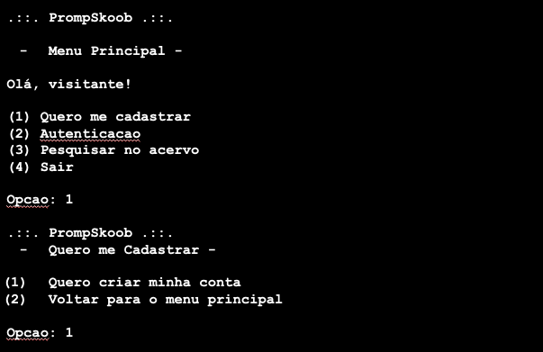

# PrompSkoob
> Uma versão minimalista do site Skoob para gerenciamento de estante de livros. Projeto desenvolvido para disciplina de
Paradigmas de Linguagens de Programação da UFCG.

## Desenvolvedores

- Álex Micaela de Oliveira Fidelis `<alex.fidelis@ccc.ufcg.edu.br>`
- Caio Benjamim Lima Simplício `<caio.simplicio@ccc.ufcg.edu.br>`
- Caroliny Mylena Bezerra e Silva `<caroliny.silva@ccc.ufcg.edu.br>`
- Júlia Fernandes Alves `<julia.alves@ccc.ufcg.edu.br>`
- Lucas Gomes Aires `<lucas.aires@ccc.ufcg.edu.br>`

## Sobre

O **PrompSkoob** é um mini programa para organização de leituras e livros. O usuário poderá criar sua conta, e assim
usufruir de recursos como recomendações de livros, registro de leitura, gerenciar o acervo geral de livros e muito mais.
Mas, caso prefira, poderá acessá-lo como visitante, podendo consultar os livros do acervo, visualizar a nota de avaliação
dada por usuários do **PrompSkoob**.

## Funcionalidades

### Menu Principal

*Figura 01: Menu principal quando usuário está autenticado.*

*Figura 02: Menu principal quando usuário é visitante.*

### Funcionalidade 01: Quero me Cadastrar

*Figura 03:  Exibição  quando usuário escolhe a opção [1] para efetuar o cadastro de usuário.*

Será exibido um submenu para o usuário confirme se deseja se cadastrar ou voltar para o menu anterior.

O usuário poderá  se cadastrar no PrompSkoob para ter acesso a recursos exclusivos.

O usuário deverá cadastrar os seguintes campos: **nome** (obrigatório),  **e-mail** (único e obrigatório) que será utilizado para autenticação no programa, **senha** de acesso (obrigatório) e a escolha de **interesses** de gêneros de livros que poderá ser utilizado no futuro para recomendação de livros. Após concluído o cadastrado o menu principal irá mudar para o menu visitante (figura 02).

Caso ocorra algum erro ao registrar as informações será exibido um mensagem de erro.
